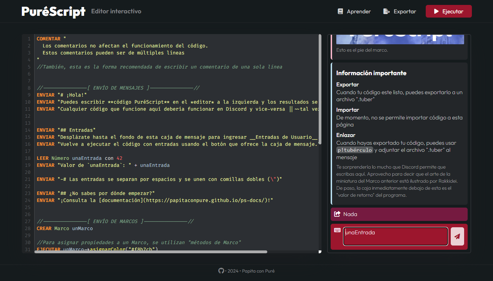

<p align="center"></p>
<h1 align="center">PuréScript</h1>
<p align="center">Lenguaje de scripting de comandos personalizados de servidor para <a href="https://github.com/PapitaConPure/bot-de-pure">Bot de Puré</a>.</p>

<br>

> [!NOTE]
> PuréScript lleva tilde en la E. No debe confundirse con PureScript, un lenguaje funcional fuertemente tipado con fines de transpilar a otros lenguajes.

<br><hr>

## Índice
* [Hola mundo](#hola-mundo)
* [Primeros pasos](#primeros-pasos)
* [Codificar por medio de un mensaje](#codificar-por-medio-de-un-mensaje)
* [Codificar por medio del editor interactivo de PuréScript](#codificar-por-medio-del-editor-interactivo-de-puréscript)
* [Importar archivos TUBER a Bot de Puré](#importar-archivos-tuber-a-bot-de-puré)

<hr><br>

## Hola Mundo
Así se envía "Hola mundo" en el chat usando PuréScript:
```arm
ENVIAR "Hola mundo"
```

## Primeros pasos 
Para utilizar PuréScript, primero debes [invitar a Bot de Puré](https://discord.com/oauth2/authorize?client_id=651250669390528561&scope=bot&permissions=1394522582224) a un servidor.

Los comandos personalizados de servidor de Bot de Puré se conocen como *Tubérculos*. Por medio del comando **p!tubérculo** podrás crear, modificar, ver y eliminar Tubérculos.

Existen Tubérculos simples, que no utilizan PuréScript, y Tubérculos avanzados, que se benefician de este lenguaje. Aquí solamente veremos cómo crear Tubérculos avanzados.

Para aprender cómo programar con PuréScript, puedes consultar la [documentación](https://papitaconpure.github.io/ps-docs/).

## Codificar por medio de un mensaje
Para crear un Tubérculo avanzado, puedes escribir en Discord:
> p!tubérculo --crear --script \`\`\`arm<br>
> ENVIAR "Hola mundo"<br>
> \`\`\`

También existe una versión acortada
> p!t -cs \`\`\`arm<br>
> ENVIAR "Hola mundo"<br>
> \`\`\`

Nótese que debes poner **\`\`\`** para marcar el inicio y final del código. El primer **\`\`\`** puede llevar **arm** inmediatamente después para colorear el código de una forma aproximadamente similar a PuréScript.

Si en lugar de crear un Tubérculo reutilizable simplemente quieres ejecutar un código PuréScript una única vez, puedes usar en cambio el comando **p!puréscript** o **p!ps**. Esto no registrará un nuevo Tubérculo en el servidor.
> p!ps ENVIAR "Hola mundo"

## Codificar por medio del editor interactivo de PuréScript
Puedes acceder al editor web interactivo de PuréScript para escribir código PuréScript de forma más cómoda.

Simplemente escribe tu código en la caja de la izquierda, ejecútalo y observa el resultado en la caja de la derecha. Cuando estés conforme con el código, puedes exportarlo con el botón "Exportar" de la barra superior.



Si el código recibe entradas o tiene diferentes resultados entre cada ejecución, puedes re-ejecutarlo por medio del botón de avión de papel de la caja de resultados.

Nótese que el editor de texto no funciona correctamente en dispositivos táctiles.

## Importar archivos TUBER a Bot de Puré
Para que Bot de Puré reciba y registre tus archivos de PuréScript ".tuber", simplemente usa el comando **p!tubérculo** y adjunta el archivo. Puedes hacer lo mismo con **p!puréscript**.
